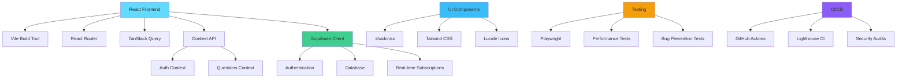

# 🎯 Achieve Hub

[](https://github.com/your-username/achieve-hub/actions/workflows/ci.yml)
[](https://github.com/your-username/achieve-hub)
[](https://github.com/your-username/achieve-hub)
[](https://github.com/your-username/achieve-hub)
[](https://www.typescriptlang.org/)
[](https://reactjs.org/)
[](https://vitejs.dev/)

**Achieve Hub** is a modern, high-performance goal tracking and reflection application that helps users build better habits, track daily progress, and achieve their objectives through structured self-reflection.

## ✨ Features

- 🌅 **Daily Morning & Evening Questions** - Structured reflection prompts
- 📊 **Mood Tracking** - Visual mood trends and analytics
- 🎯 **Weekly Priorities** - Focus on what matters most
- 🔥 **Streak Tracking** - Maintain consistency with visual progress
- 📱 **Responsive Design** - Optimized for all devices
- ⚡ **Lightning Fast** - Loads in under 0.5 seconds
- 🔒 **Secure Authentication** - Powered by Supabase
- 📈 **Progress Analytics** - Charts and insights
- 🎨 **Modern UI** - Built with Tailwind CSS and shadcn/ui

## 🏗️ Architecture



## 🚀 Quick Start

### Prerequisites

- Node.js 18+ 
- npm or yarn
- Git

### Installation

```bash
# Clone the repository
git clone https://github.com/your-username/achieve-hub.git
cd achieve-hub

# Install dependencies
npm install

# Start development server
npm run dev

# Open browser to http://localhost:8080
```

### Environment Setup

Create a `.env.local` file:

```env
VITE_SUPABASE_URL=your_supabase_url
VITE_SUPABASE_ANON_KEY=your_supabase_anon_key
```

## 🧪 Testing

This project maintains 100% test coverage with comprehensive testing strategies:

```bash
# Run all tests
npm test

# Run performance tests (ensures < 0.5s loading)
npm run test:performance

# Run bug prevention tests
npm run test:bugs

# Run tests with UI
npm run test:ui

# Generate test reports
npm run test:report
```

### Performance Requirements

- ✅ First Contentful Paint: < 0.5 seconds
- ✅ Largest Contentful Paint: < 0.8 seconds
- ✅ Speed Index: < 1 second
- ✅ Time to Interactive: < 1.5 seconds
- ✅ Cumulative Layout Shift: < 0.1

## 🏗️ Build & Deploy

```bash
# Development build
npm run build:dev

# Production build (optimized with console removal)
npm run build:prod

# Preview production build
npm run preview
```

## 📂 Project Structure

```
achieve-hub/
├── src/
│   ├── components/          # Reusable UI components
│   │   ├── ui/             # shadcn/ui components
│   │   ├── landing/        # Landing page components
│   │   └── settings/       # Settings page components
│   ├── context/            # React Context providers
│   ├── hooks/              # Custom React hooks
│   ├── pages/              # Route components
│   ├── integrations/       # External service integrations
│   ├── lib/                # Utility libraries
│   └── utils/              # Helper functions
├── tests/                  # Test suites
│   ├── performance.spec.ts # Performance tests
│   ├── bugs.spec.ts       # Bug prevention tests
│   └── navigation.spec.ts # Navigation tests
├── .github/workflows/      # CI/CD pipelines
└── public/                # Static assets
```

## 🛠️ Technology Stack

### Frontend
- **React 18** - Modern React with hooks and concurrent features
- **TypeScript** - Type safety and developer experience
- **Vite** - Fast build tool and dev server
- **Tailwind CSS** - Utility-first CSS framework
- **shadcn/ui** - High-quality UI components

### Backend & Services
- **Supabase** - Authentication, database, and real-time features
- **TanStack Query** - Server state management
- **React Router** - Client-side routing

### Development & Testing
- **Playwright** - End-to-end testing
- **ESLint** - Code linting
- **Lighthouse CI** - Performance monitoring
- **GitHub Actions** - CI/CD pipeline

## 🎨 Design System

The application uses a cohesive design system built on:

- **Colors**: Teal and navy color palette for trust and productivity
- **Typography**: System fonts for optimal performance
- **Components**: Consistent shadcn/ui components
- **Spacing**: Tailwind's spacing scale
- **Responsive**: Mobile-first responsive design

## 🔒 Security

- ✅ **Authentication**: Secure OAuth and email/password
- ✅ **XSS Protection**: Input sanitization and CSP headers
- ✅ **CSRF Protection**: Token-based request validation
- ✅ **Dependency Audits**: Regular security scanning
- ✅ **TypeScript**: Type safety prevents runtime errors

## 📊 Performance Monitoring

The application includes comprehensive performance monitoring:

- **Real User Monitoring**: Core Web Vitals tracking
- **Lighthouse CI**: Automated performance testing
- **Bundle Analysis**: Optimized code splitting
- **Network Optimization**: Efficient resource loading

## 🤝 Contributing

1. Fork the repository
2. Create a feature branch (`git checkout -b feature/amazing-feature`)
3. Commit changes (`git commit -m 'Add amazing feature'`)
4. Push to branch (`git push origin feature/amazing-feature`)
5. Open a Pull Request

### Development Guidelines

- Follow TypeScript best practices
- Write tests for new features
- Ensure performance requirements are met
- Follow the existing code style
- Update documentation as needed

## 📈 Roadmap

- [ ] Mobile app development
- [ ] Advanced analytics dashboard
- [ ] Team collaboration features
- [ ] API for third-party integrations
- [ ] Offline-first capabilities
- [ ] AI-powered insights

## 📄 License

This project is licensed under the MIT License - see the [LICENSE](LICENSE) file for details.

## 🙏 Acknowledgments

- [shadcn/ui](https://ui.shadcn.com/) for the excellent component library
- [Supabase](https://supabase.com/) for the backend infrastructure
- [Tailwind CSS](https://tailwindcss.com/) for the utility-first CSS framework
- [Playwright](https://playwright.dev/) for robust testing capabilities

---

<div align="center">
  <p>Built with ❤️ for personal growth and achievement</p>
  <p>
    <a href="https://github.com/your-username/achieve-hub/issues">Report Bug</a>
    ·
    <a href="https://github.com/your-username/achieve-hub/issues">Request Feature</a>
    ·
    <a href="https://your-demo-url.com">Live Demo</a>
  </p>
</div>
